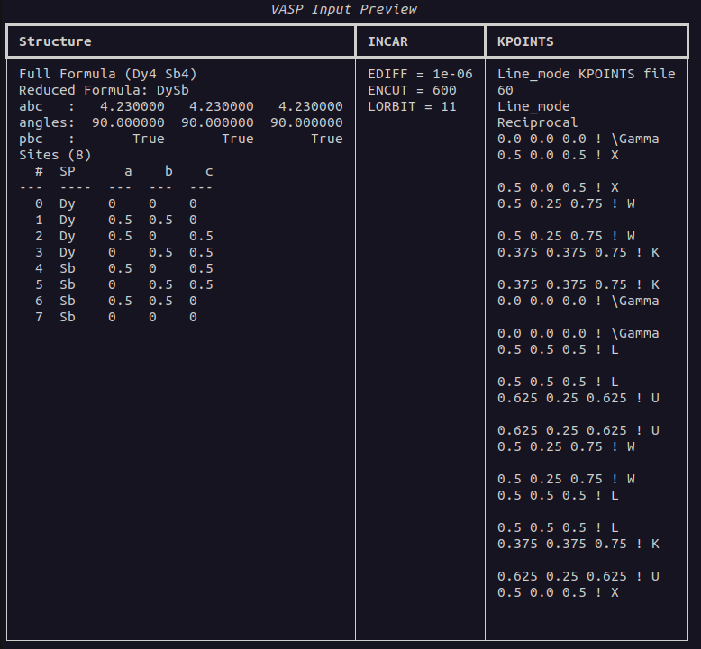

# Installation

abvio is currently only available on PyPI, but you can clone the repository and install it yourself 

```
pip install abvio
```


## CLI Usage 

abvio is a CLI-first program. Therefore, the only entry-point you will need is the `abvio` command. We can run a quick example of converting your own VASP input set to an abvio.yaml file to get a feel for the format. We can do this by navigating to the directory containing your VASP input files and running the following command

```bash
abvio . --convert -o myfile.yaml
```

Which will produce a file named `myfile.yaml`. You can then verify that this worked by running

```bash
abvio myfile.yaml --preview
```

And it will give you a formatted glimpse of what it has read in. If you are satisfied with the results, run

```bash
abvio myfile.yaml -o . 
```

which will write out the files INCAR, KPOINTS, and POSCAR. Be careful though, this program will overwrite exisiting files!


## Writing an input file

My recommendation to writing your first input file would be to start with the simplest thing and go from there. This is why I recommend you working with either prototype structures or pulling from the materials project structure repository. Since this tutorial should get you up and running quickly, we will be working with prototypes as they do not require you setting up a Materials Project account/API key. 

A rough outline is always recommended:

1. structure is DySb (rock salt structure!)
2. we want a fine sampling, so 60 kpoints per path

We can quickly translate that into a file

```yaml
structure:
    mode: prototype
    prototype: rocksalt
    species: [Dy, Sb]
    lattice:
        a: 4.23
incar:
    ediff: 1e-06
    lorbit: 11
    encut: 600
kpoints:
    mode: autoline
    spacing: 60
```

And if we run preview, we will get the following output:


